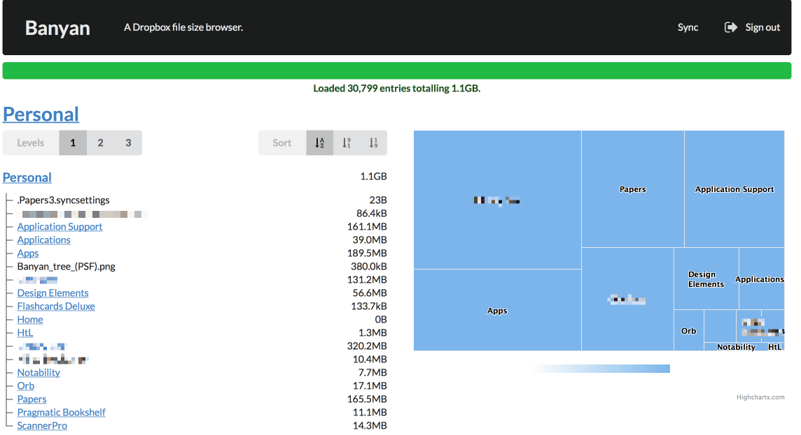

# Banyan

Browse your Dropbox directory size.



## Develop

### Install

Install [yarn](https://yarnpkg.com).

```bash
$ yarn install
$ elm-package install
```

The build currently depends on a fork of <https://github.com/avh4/elm-dropbox>.
Clone or download <https://github.com/osteele/elm-dropbox> to a sibling of
the `banyan` workspace:

```bash
$ (cd .. && git clone https://github.com/osteele/elm-dropbox.git)
```

### Run

```bash
$ yarn start
```

### Test

```bash
$ yarn test
```

### Lint

```bash
$ yarn lint
```

## Acknowledgements

Build with [Elm](http://elm-lang.org/),
[elm-dropbox](http://package.elm-lang.org/packages/avh4/elm-dropbox/latest),
[Highcharts](https://www.highcharts.com/products/highcharts/), [Semantic
UI](https://semantic-ui.com/), and [Poi](https://poi.js.org/#/).

The [Banyan tree
image](https://commons.wikimedia.org/wiki/File:Banyan_tree_(PSF).png) has
donated to the Wikimedia Foundation by Pearson Scott Foresman, and is
in the public domain.

Highcharts is used under
the Creative Commons (CC) Attribution-NonCommercial licence for personal use
and demonstrations.

## License

Copyright 2018 by Oliver Steele. All rights reserved.
