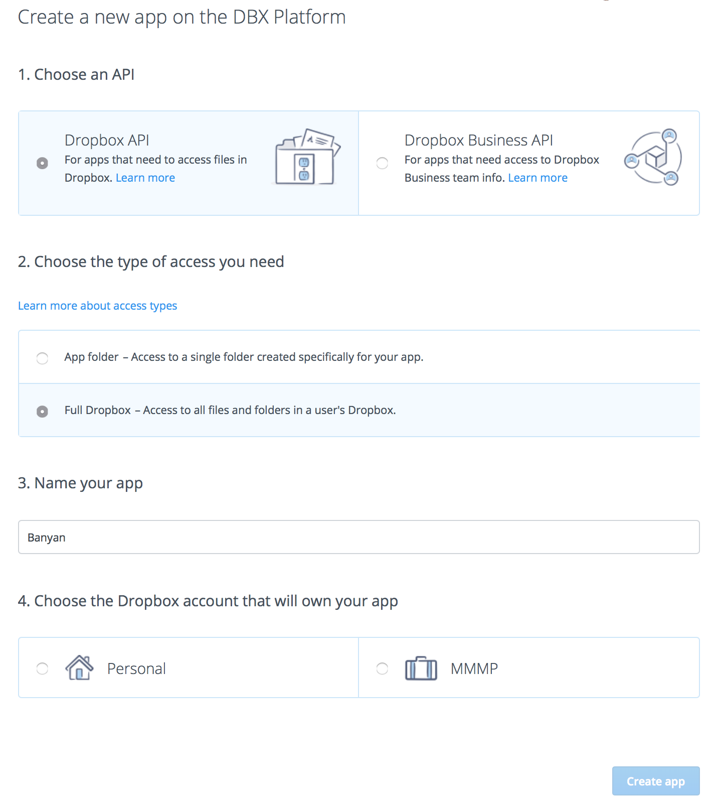
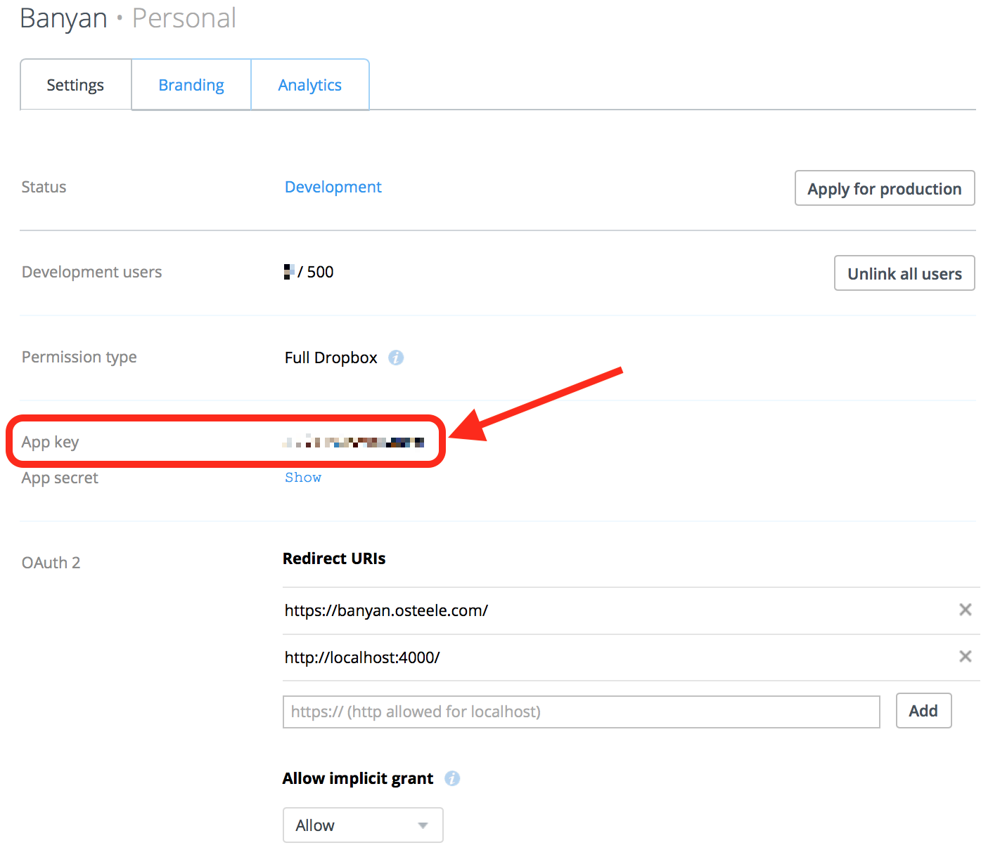

# Banyan

Visualize Dropbox file and directory sizes.


## Develop

### Install

Install [yarn](https://yarnpkg.com).

```bash
$ yarn install
```

The build currently depends on a fork of <https://github.com/avh4/elm-dropbox>.
Clone or download <https://github.com/osteele/elm-dropbox> to a sibling of
the `banyan` workspace:

```bash
$ (cd .. && git clone https://github.com/osteele/elm-dropbox.git)
```

### Create a Dropbox API Key

Sign into Dropbox.

[Create a new app](https://www.dropbox.com/developers/apps/create). Select
“Dropbox API”, and give it “Full Dropbox” access.



Add `http://localhost:4000/` to the list of Redirect URIs.

Set the `DROPBOX_APP_KEY` environment variable to the app's API key (highlighted
below). If you use [direnv](https://direnv.net/), you can copy `.envrc.template`
to `.envrc` and edit the key into that file.



### Run

```bash
$ yarn start
```

### Test

```bash
$ yarn test        # run the tests once
$ yarn test:watch  # test in watch mode
```

### Lint

```bash
$ yarn lint
```

## Acknowledgements

Build with [Elm](http://elm-lang.org/),
[elm-dropbox](http://package.elm-lang.org/packages/avh4/elm-dropbox/latest),
[Highcharts](https://www.highcharts.com/products/highcharts/), [Semantic
UI](https://semantic-ui.com/), and [Poi](https://poi.js.org/#/).

The [Banyan tree
image](<https://commons.wikimedia.org/wiki/File:Banyan_tree_(PSF).png>) used in
this app's Dropbox OAuth page was donated to the Wikimedia Foundation by Pearson
Scott Foresman. It is in the public domain.

Highcharts is used under the Creative Commons (CC) Attribution-NonCommercial
licence for personal use and demonstrations.

## License

MIT
